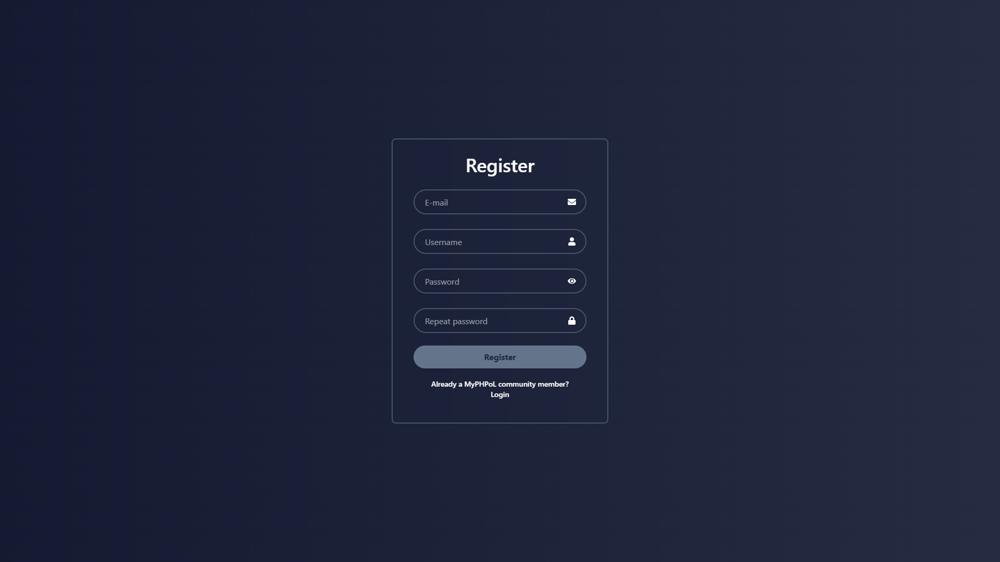

# MyCommsFront

> Frontend for MyCommsPoL -- a messaging app written in TS with React

## Features

- a fully working frontend for messaging app
- communication with server with the use of Axios
- create, join and manage servers
- moderate servers as an owner
- each server can consist of multiple channels
- spice up your server with custom descriptions and icons
- send invites, block users and manage invitations
- send private messages to your friends
- send files and embed links
- find your favourite emojis with emoji-picker-react
- manage your favourite gifs with Tenor integration
- real time messaging with the use of websockets

## Installation and Usage

To work firstly you need to download and configure MyCommsPoL

installing packages:
```bash
npm install --force
```

launching app:
```bash 
npm start
```

## Screenshots





## Used Libraries

- mui
- tailwind
- axios
- notistack
- emoji-picker-react
- mui-file-input
- react-lazy-load-image-component
- signalr

## Made By

Piotr Radziszewski \
Paweł Świerzbiński \
Paweł Oświeciński \
Dawid Szymański

MyPHPoL™ 2024